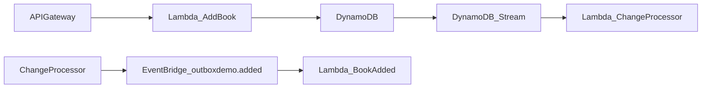

# AWS inbox pattern demo: DynamoDB, EventBridge, Lambda

This repository demonstrates the serverless [outbox pattern](https://d1.awsstatic.com/architecture-diagrams/ArchitectureDiagrams/aws-reference-architecture-hybrid-domain-consistency-ra.pdf?did=wp_card&trk=wp_card) as applied to a serverless architecture in AWS. An easier execution than many traditional similar solutions, here we can use DynamoDB and its Streams capability to solve the messaging/queuing otherwise required.

The key infrastructural components are Lambda, DynamoDB, and EventBridge.

## Explanation

For our demonstration we will have a system in which books can be added or removed.

For the "book added" usecase, the flow is:

Incoming calls run the appropriate function. The function runs an operation on the database table. Whenever a change happens in DynamoDB, it will stream the change to an intermediary Lambda, called `ChangeProcessor`. This function will inspect the list of changes and consequently emit the corresponding events which other functions respond to.

This solution uses a **single** table to bring the overall point across. It offers a relatively basic solution to the problem, but is also potentially more limited in flexibility. In this type of solution, we are limited to the context of the data that is persisted (optimized, of course, for such use) and an event name based on the database operation, i.e. `INSERT` and `REMOVE`. It may be hard to granularly emit (integration) events to the rest of your landscape based on rich context.

Using a table for the data itself, and a separate table for the events, brings additional freedom in bringing more information and context which downstream change data capture processors can work with. Please see [this article](https://betterprogramming.pub/implementing-the-transactional-outbox-pattern-with-eventbridge-pipes-125cb3f51f32) for more on such an evolution.

## References

- [Publishing EventBridge events with DynamoDB Streams](https://www.boyney.io/blog/2022-11-03-eventbridge-events-with-dynamodb)
- [Outbox pattern with DynamoDB and EventBridge](https://serverlessland.com/patterns/dynamodb-streams-to-eventbridge-outbox-pattern)

A more elaborate version is outlined at:

- [Implementing the Transactional Outbox Pattern With EventBridge Pipes](https://betterprogramming.pub/implementing-the-transactional-outbox-pattern-with-eventbridge-pipes-125cb3f51f32)
