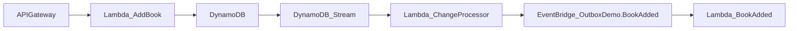
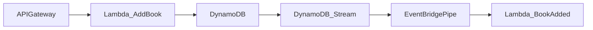

# AWS inbox pattern demo: DynamoDB, EventBridge, Lambda

This repository demonstrates the serverless [outbox pattern](https://d1.awsstatic.com/architecture-diagrams/ArchitectureDiagrams/aws-reference-architecture-hybrid-domain-consistency-ra.pdf?did=wp_card&trk=wp_card) as applied to a serverless architecture in AWS. An easier execution than many traditional similar solutions, here we can use DynamoDB and its [Streams](https://docs.aws.amazon.com/amazondynamodb/latest/developerguide/Streams.html) capability to solve the messaging/queuing otherwise required.

The key infrastructural components are [Lambda](https://aws.amazon.com/lambda/), [DynamoDB](https://aws.amazon.com/dynamodb/), and [EventBridge](https://aws.amazon.com/eventbridge/).

## Explanation

For our demonstration we will have a system in which books can be added or removed.

There are two implementations, as seen in `serverless.yml` and `serverless.cdc.yml`, respectively. **The `cdc` (change data capture) version is the first we'll look at.**

For the "book added" usecase, the flow is:



Incoming calls run the appropriate function to add or remove a book. The function runs an operation on the database table to do this. Whenever a change happens in DynamoDB, it will stream the change to an intermediary Lambda, called `ChangeProcessor`. This function will inspect the list of changes and consequently emit the corresponding events which other functions respond to.

### Limitations and a more elaborate solution

You've seen that this solution uses a **single** table to bring the overall point across. It offers a relatively basic solution to the problem but is also potentially more limited in flexibility. In this type of solution, we are limited to the context of the data that is persisted (optimized, of course, for such use) and an event name based on the database operation, i.e. `INSERT` and `REMOVE`. It may be hard to granularly emit (integration) events to the rest of your landscape based on rich context, if you're doing it this way.

_Separate tables for the data and the events brings additional freedom in allowing more information and context which downstream receivers can work with. Please see [this article](https://betterprogramming.pub/implementing-the-transactional-outbox-pattern-with-eventbridge-pipes-125cb3f51f32) for more on such an evolution, which uses a separate events tables as well as EventBridge Pipes for configuration-driven processing._

We'll address at least one more improvement here, and that's using [EventBridge Pipes](https://docs.aws.amazon.com/eventbridge/latest/userguide/eb-pipes.html) to allow for configuration over code.



**For this next section the corresponding definition file is `serverless.yml`.**

You'll note the definition is longer, but no longer contains the `ChangeProcessor`—this is, as expected, because we now use the Pipe to pass the data as events, instead of running a Lambda with somewhat complicated code to process the change data and emitting the events. An extra bonus is we use [input transformers](https://docs.aws.amazon.com/eventbridge/latest/userguide/eb-transform-target-input.html) to simplify the payloads that are used by receiving functions. More importantly, we've now also gained the capability to more easily express what filters we want to use on the data before it ends up as an event. See `BookAddedPipe` and `BookRemovedPipe` in the definition for more details.

---

## Prerequisites

- Recent [Node.js](https://nodejs.org/en/) (ideally 18+) installed.
- Amazon Web Services (AWS) account with sufficient permissions so that you can deploy infrastructure.
- Ideally some experience with [Serverless Framework](https://www.serverless.com) as that's what we will use to deploy the service and infrastructure.

## Installation

Clone, fork, or download the repo as you normally would. Run `npm install`.

## Commands

- `npm start`: Run application locally
- `npm test`: Test the business/application logic with Jest
- `npm run build`: Package application with Serverless Framework
- `npm run deploy`: Deploy application to AWS with Serverless Framework
- `npm run teardown`: Remove stack from AWS

## Running locally

Using `npm start` you can start using the local endpoint with `http://localhost:3000/{FUNCTION}` to call the service. See example calls below.

## API calls

### Adding a book

```bash
curl -X POST -d @input.json http://localhost:3000/book
```

Which should respond back with a `201` status.

### Removing a book

```bash
curl -X DELETE -d '{"name": "Team Topologies"}' http://localhost:3000/book
```

Which should respond back with a `204` status.

---

## References

- [Publishing EventBridge events with DynamoDB Streams](https://www.boyney.io/blog/2022-11-03-eventbridge-events-with-dynamodb)
- [Outbox pattern with DynamoDB and EventBridge](https://serverlessland.com/patterns/dynamodb-streams-to-eventbridge-outbox-pattern)
- [Change data capture events into multiple EventBridge pipes](https://serverlessland.com/patterns/eventbridge-pipes-ddbstream-with-filters-to-eventbridge)

A more elaborate version is outlined at:

- [Implementing the Transactional Outbox Pattern With EventBridge Pipes](https://betterprogramming.pub/implementing-the-transactional-outbox-pattern-with-eventbridge-pipes-125cb3f51f32)
